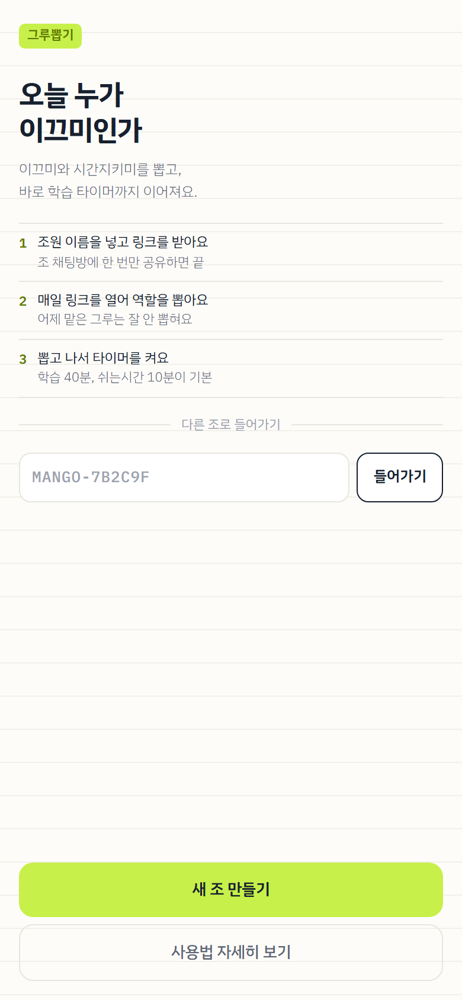
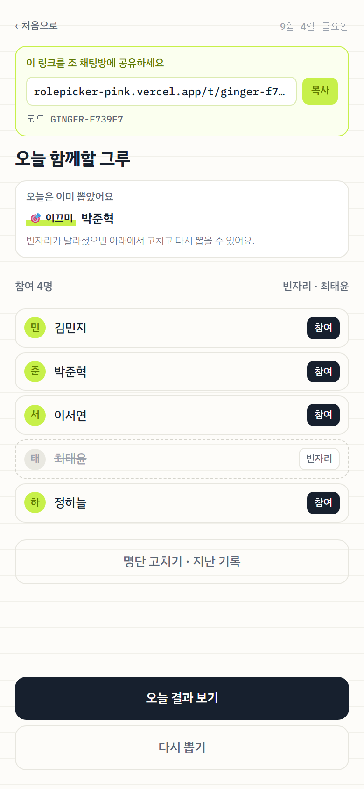
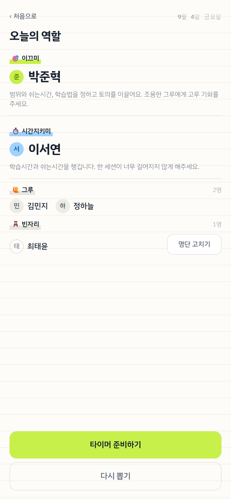
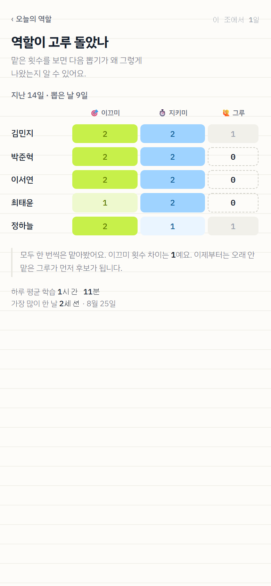
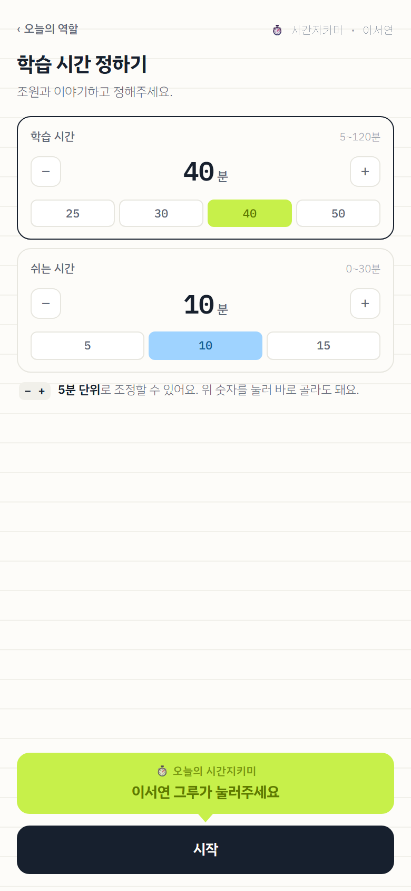
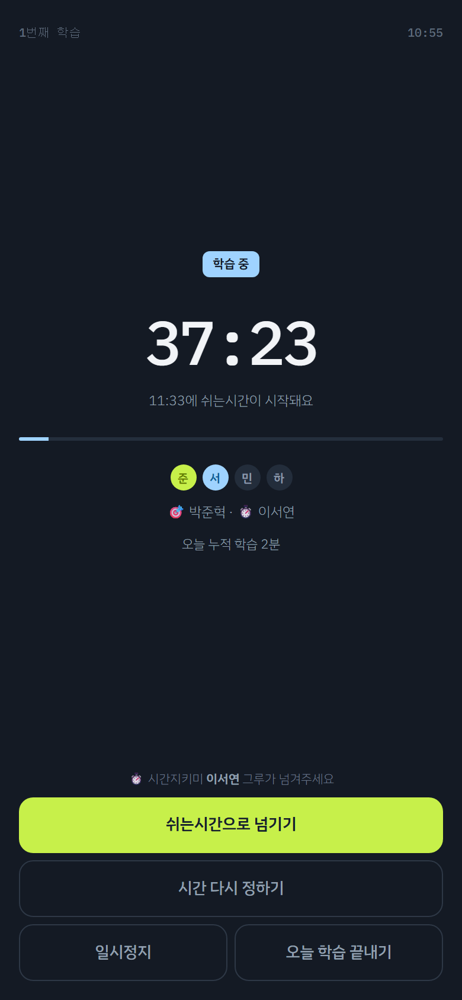
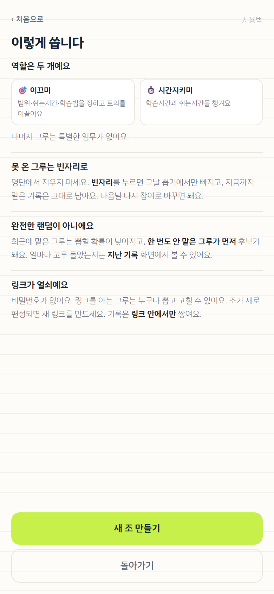

# 그루뽑기

학습 조에서 매일 **이끄미**와 **시간지키미**를 공정하게 뽑고, 그대로 학습 타이머로 이어지는 웹 서비스.

### 👉 [rolepicker-pink.vercel.app](https://rolepicker-pink.vercel.app)

설치도 로그인도 없다. 링크 하나를 조 채팅방에 공유하면 그날부터 쓴다.

<table>
<tr>
<td width="25%"></td>
<td width="25%"></td>
<td width="25%"></td>
<td width="25%"></td>
</tr>
<tr>
<td align="center"><sub>첫 화면</sub></td>
<td align="center"><sub>누가 왔는지 확인</sub></td>
<td align="center"><sub>오늘의 역할</sub></td>
<td align="center"><sub>고루 돌았는지 확인</sub></td>
</tr>
</table>

<table>
<tr>
<td width="25%"></td>
<td width="25%"></td>
<td width="25%"></td>
<td width="25%"></td>
</tr>
<tr>
<td align="center"><sub>시간은 조원이 함께 정한다</sub></td>
<td align="center"><sub>모두의 화면이 같이 움직인다</sub></td>
<td align="center"><sub>사용법은 한 화면</sub></td>
<td></td>
</tr>
</table>

---

## 쓰는 법

**1. 조를 만든다** — `새 조 만들기`에 조원 이름을 넣으면 링크가 나온다. 채팅방에 한 번만 올린다.

**2. 매일 그 링크를 연다** — 오늘 온 사람을 확인하고 `역할 뽑기`.

**3. 뽑고 나서 타이머를 켠다** — 한 명이 `시작`을 누르면 조원 전원의 화면이 같이 타이머로 바뀐다. 일시정지도 다 같이 멈춘다.

### 알아둘 세 가지

**못 온 그루는 명단에서 지우지 말고 `빈자리`로 바꾼다.** 지우면 그 사람이 지금까지 몇 번 맡았는지가 통째로 사라져서 공정성 계산이 틀어진다. 빈자리는 그날만 빠지고 기록은 남는다.

**완전한 랜덤이 아니다.** 최근에 맡은 사람은 덜 뽑히고, 한 번도 안 맡은 사람이 먼저 후보가 된다. 그래서 `지난 기록` 화면의 숫자가 고르게 찬다.

**링크가 열쇠다.** 비밀번호가 없다. 링크를 아는 사람은 누구나 뽑고 고칠 수 있으므로 조 채팅방 밖으로 내보내지 않는다. 조가 새로 편성되면 새 링크를 만든다. 기록은 링크 안에서만 쌓인다.

링크를 잃어버렸으면 `MANGO-7B2C9F` 같은 **코드**를 첫 화면에 넣으면 들어갈 수 있다. 코드는 `명단 고치기` 화면 아래에 항상 떠 있다.

---

## 만든 이야기

핵심 가치는 랜덤이 아니라 **"고루 돌아갔다는 것이 눈에 보이는 것"**이다. 판단이 필요할 때는 PRD §3의 설계 원칙 7개로 돌아간다.

코드 주석 곳곳의 `PRD §3`, `PRD §14` 같은 표시는 이 저장소에 없는 요구사항 문서의 조항 번호다.
어떤 결정이 어디서 왔는지를 남기려고 붙여뒀고, 그 결정의 내용 자체는 해당 코드의 주석에 함께 적어놨다.

### 배정 알고리즘

`back/assign.ts` 한 파일에 격리돼 있다. DB도, 현재 시각도, `Math.random`도 직접 만지지 않고 전부 인자로 받는다. 그래서 화면 없이 수만 번 돌려볼 수 있다.

```
쿨다운 3일 · 미경험자 가중치 999 · 가중치 = 그 역할을 마지막으로 맡은 날로부터 지난 일수
```

#### PRD와 다르게 정한 것

**다시 뽑기는 직전 당첨자를 그 역할 후보에서 제외한다.** PRD §7은 "같은 알고리즘을 다시 돌린다"고만 적어놨는데, 그대로 하면 5명 조에서 **49%가 같은 사람이 다시 나온다**(후보가 평균 2.3명뿐이라서). 버튼이 아무 일도 안 한 것처럼 보이므로 그 역할에 한해 직전 당첨자를 뺀다. 후보가 0명이 되는 조(1~2명)에서는 되돌린다.

#### 공정성 실측값

시드를 고정해 200회씩 시뮬레이션한 결과(2주, 매일 전원 참여). 이끄미 횟수 최대-최소 차이:

| 인원 | 산수적 최선 | 최선 달성 | 최악 |
|---|---|---|---|
| 5명 | 1 | 162/200 | 3 |
| 7명 | 0 | 28/200 | 3 |
| 12명 | 1 | 199/200 | 2 |

"차이 1 이하"라는 기준은 인원에 따라 뜻이 달라진다. 7명이 14일을 나누면 전원 2번(차이 0) 아니면 누군가 3번·누군가 1번(차이 2)이라, **차이 1인 결과는 존재할 수 없다.**

차이가 2까지 벌어지는 경우가 남아 있는 것은 PRD §7의 "완전 결정론적으로 만들지 말 것"과 맞바꾼 결과다. 결과 화면의 **다시 뽑기**가 사람이 개입하는 보정 장치다.

바꾸고 싶으면 후보를 좁히는 규칙 한 줄(가장 적게 맡은 사람만 후보)을 넣으면 3~12명 전 구간에서 최선을 100% 달성한다. 대신 한 바퀴의 마지막 날은 결과가 정해진다. 실제로 2주 써보고 `지난 기록` 화면의 숫자를 보고 결정한다.

---

## 개발

```bash
npm install
npm run dev        # http://localhost:3000
npm test           # 단위 테스트
npm run typecheck  # 타입 검사
```

Supabase 값이 `.env.local`에 있어야 조를 만들 수 있다 (`supabase/README.md`). 값이 없으면 화면이 죽지 않고 설정 안내를 보여준다.
`npm test`는 DB 없이 돌아간다.

### 폴더 구조

```
app/       주소록. Next.js는 폴더 이름이 곧 웹 주소가 되므로 위치를 옮길 수 없다.
           대신 로직을 한 줄도 두지 않고 "이 주소는 저 함수"만 가리킨다
front/     화면
back/      서버 — DB 접근, 배정, API 구현. 비밀값은 이 폴더 밖으로 나가지 않는다
shared/    양쪽이 같이 쓰는 것 — 날짜, 이름 규칙, 주고받는 값의 모양
supabase/  DB 설계와 연결 방법
docs/      API 구성, 보안 정리, 배포 순서, 화면 사진
```

경계는 문서가 아니라 검사가 지킨다 (`back/boundaries.test.ts`). `front`가 `back`을 불러오거나 서버 키가 `back` 밖에 나타나면 `npm test`가 실패한다.

### 문서

| 파일 | 내용 |
|---|---|
| `docs/API.md` | 주소 10개의 요청·응답·오류, 멱등성 구현, 타이머, 지난 기록 |
| `docs/SECURITY.md` | 비밀값을 어디 두는지, 세 겹의 차단 |
| `supabase/README.md` | Supabase 연결 순서 (복사·붙여넣기만). SQL 두 개를 돌린다 |
| `docs/DEPLOY.md` | Vercel 배포 순서, 누가 쓸 수 있고 무엇이 막혀 있는지 |

### 만든 순서 (PRD §15)

| | 내용 | 상태 |
|---|---|---|
| M1 | 조 생성 → 명단 → 참여/빈자리 → 서버 배정 → 결과 | 완료 |
| M2 | 타이머 | 완료 |
| M3 | 지난 기록 | 완료 |
| M4 | 다듬기 (첫 화면 두 상태, 사용법, 연출, PWA) | 완료 |

검사 169개.

### 기술

Next.js (App Router) · TypeScript · Tailwind · Supabase(Postgres) · Vercel

DB는 서버에서만 만진다. 모든 표에 RLS를 켜고 브라우저 역할의 권한을 회수해서, 키가 새더라도 브라우저에서는 아무것도 못 읽는다 (`docs/SECURITY.md`).
